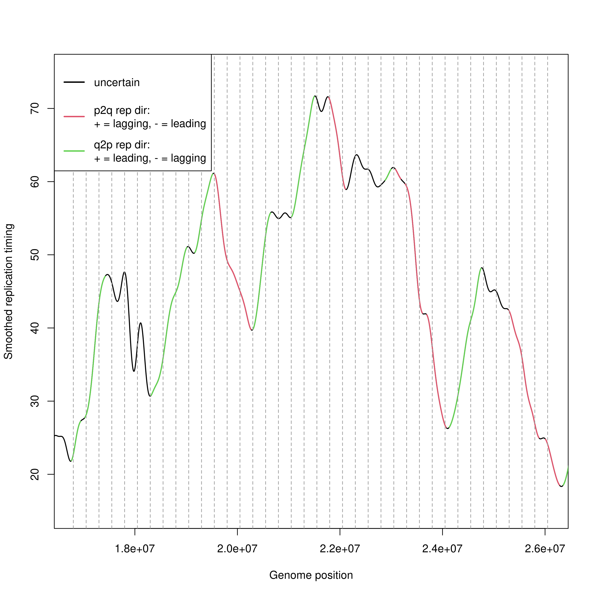

# reptDir: R package for annotating replication timing direction.



## Installation (requires the `devtools` package to be installed)
In an R session:
```
devtools::install_github("https://github.com/MikeACG/reptDir")
```

## What algorithm is used to determine replication direction?
The method used for assigning replication direction to each range is inspired by the descriptions of Morganella et al. (2016). For details, see `?reptDir`.

## Usage
For a usage example see the vignette after installing the package:
```
utils::browseVignettes("reptDir")
```
## References
- Morganella S, Alexandrov LB, Glodzik D, Zou X, Davies H, Staaf J, Sieuwerts AM, Brinkman AB, Martin S, Ramakrishna M, Butler A, Kim H, Borg Ake, Sotiriou C, Futreal PA, Campbell PJ, Span PN, Van Laere S, Lakhani SR, Eyfjord JE, Thompson AM, Stunnenberg HG, van de Vijver MJ, Martens JWM, Børresen-Dale A, Richardson AL, Kong G, Thomas G, Sale J, Rada C, Stratton MR, Birney E, Nik-Zainal S (2016). “The topography of mutational processes in breast cancer genomes.” _Nat. Commun._, *7*(1), 11383.
